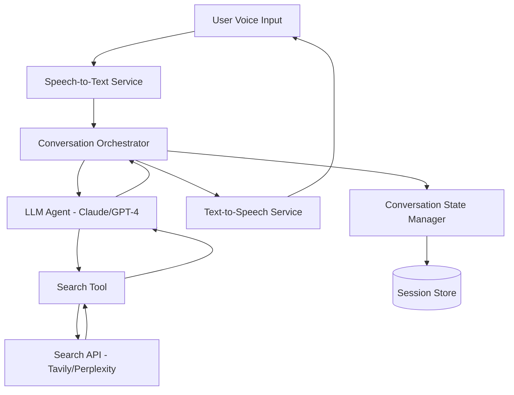
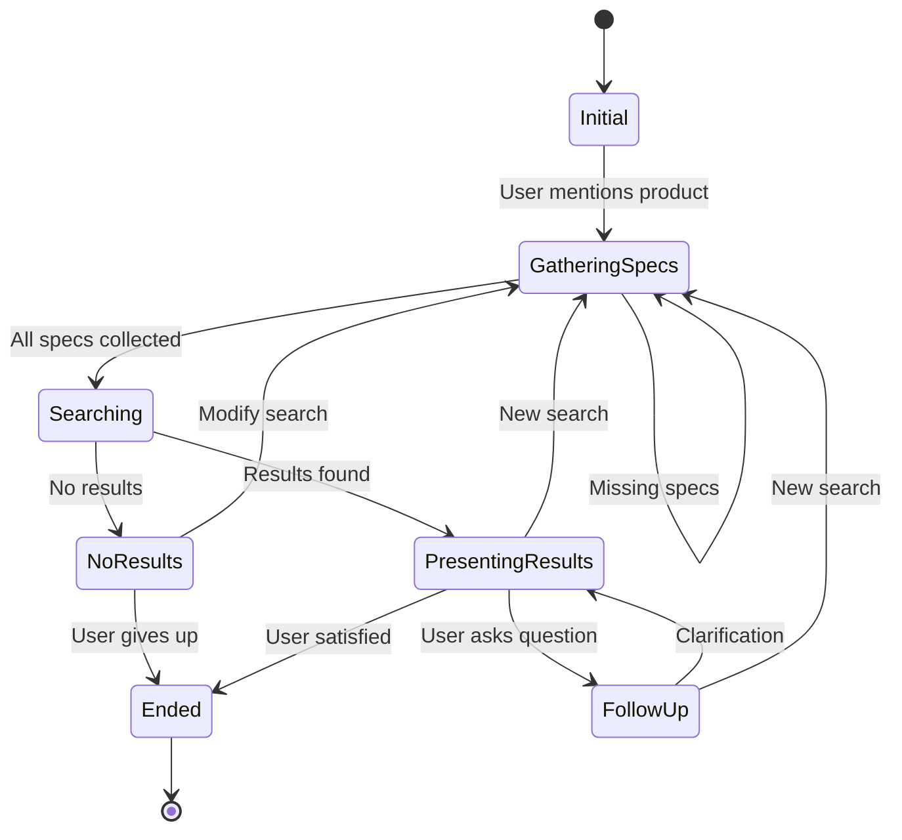

# Design Document: Voice Price Comparison Agent

## Overview

The Voice Price Comparison Agent is a conversational AI system that enables users to find the best prices for products across multiple e-commerce platforms using voice interaction. The system integrates speech-to-text (STT), large language model (LLM) reasoning, web search capabilities, and text-to-speech (TTS) to create a seamless voice-first experience.

### Key Design Principles
- **Conversational Flow**: Natural dialogue that feels human-like
- **Accuracy First**: Ensure specification matching before price comparison
- **Modularity**: Pluggable components for STT, TTS, LLM, and search providers
- **Error Resilience**: Graceful degradation and clear error communication
- **Performance**: Minimize latency in voice interactions (target < 2 seconds response time)

## Architecture

### High-Level Architecture



### Component Architecture

The system follows a microservices-inspired architecture with the following layers:

1. **Interface Layer**: Handles voice input/output
2. **Orchestration Layer**: Manages conversation flow and state
3. **Intelligence Layer**: LLM-based reasoning and decision making
4. **Tool Layer**: External service integrations (search, scraping)
5. **Data Layer**: Session and conversation state management

## Components and Interfaces

### 1. Speech-to-Text Service

**Responsibility**: Convert user voice input to text

**Recommended Implementation**: OpenAI Whisper API or Google Cloud Speech-to-Text

**Interface**:
```typescript
interface STTService {
  transcribe(audioBuffer: Buffer, options?: TranscribeOptions): Promise<TranscriptionResult>;
  streamTranscribe(audioStream: ReadableStream): AsyncIterator<TranscriptionChunk>;
}

interface TranscriptionResult {
  text: string;
  confidence: number;
  language?: string;
  duration: number;
}

interface TranscribeOptions {
  language?: string;
  model?: string;
  enableNoiseReduction?: boolean;
}
```

**Key Features**:
- Support for multiple audio formats (WAV, MP3, WebM)
- Real-time streaming for low latency
- Noise reduction and echo cancellation
- Confidence scoring for quality control

### 2. Text-to-Speech Service

**Responsibility**: Convert agent responses to natural speech

**Recommended Implementation**: OpenAI TTS API or ElevenLabs

**Interface**:
```typescript
interface TTSService {
  synthesize(text: string, options?: SynthesizeOptions): Promise<AudioBuffer>;
  streamSynthesize(text: string): AsyncIterator<AudioChunk>;
}

interface SynthesizeOptions {
  voice?: string;
  speed?: number;
  pitch?: number;
  format?: 'mp3' | 'wav' | 'opus';
}

interface AudioBuffer {
  data: Buffer;
  format: string;
  duration: number;
}
```

**Key Features**:
- Multiple voice options (male/female, different accents)
- SSML support for emphasis and pauses
- Streaming for reduced latency
- Caching for common phrases

### 3. Conversation Orchestrator

**Responsibility**: Manage conversation flow, coordinate components, handle state

**Interface**:
```typescript
interface ConversationOrchestrator {
  handleUserInput(sessionId: string, audioInput: Buffer): Promise<AudioBuffer>;
  startSession(): Promise<string>;
  endSession(sessionId: string): Promise<void>;
  getSessionState(sessionId: string): Promise<SessionState>;
}

interface SessionState {
  sessionId: string;
  conversationHistory: Message[];
  currentProduct?: ProductQuery;
  lastActivity: Date;
  status: 'active' | 'waiting' | 'completed';
}

interface Message {
  role: 'user' | 'assistant';
  content: string;
  timestamp: Date;
}
```

**Key Responsibilities**:
- Route audio input through STT
- Maintain conversation context
- Invoke LLM agent with appropriate context
- Handle errors and retries
- Route responses through TTS
- Manage session lifecycle

### 4. LLM Agent (Intelligence Core)

**Responsibility**: Understand user intent, extract information, make decisions, orchestrate tools

**Recommended Implementation**: Claude 3.5 Sonnet or GPT-4 with function calling

**Interface**:
```typescript
interface LLMAgent {
  processUserMessage(message: string, context: ConversationContext): Promise<AgentResponse>;
  extractProductInfo(message: string): Promise<ProductQuery>;
  validateSpecifications(product: ProductQuery): Promise<ValidationResult>;
}

interface ConversationContext {
  history: Message[];
  currentProduct?: ProductQuery;
  searchResults?: SearchResult[];
}

interface AgentResponse {
  message: string;
  action?: AgentAction;
  requiresUserInput: boolean;
  updatedProduct?: ProductQuery;
}

interface AgentAction {
  type: 'search' | 'clarify' | 'compare' | 'end';
  parameters?: Record<string, any>;
}
```

**System Prompt Design**:
The LLM will be configured with a system prompt that defines its role:
- Act as a helpful shopping assistant
- Always confirm specifications before searching
- Be concise in voice responses
- Use tools to search for prices
- Compare products with matching specifications only

**Function Calling Tools**:
```typescript
const tools = [
  {
    name: 'search_product_prices',
    description: 'Search for product prices across multiple platforms',
    parameters: {
      productName: 'string',
      specifications: 'object',
      platforms: 'string[]'
    }
  },
  {
    name: 'clarify_specifications',
    description: 'Ask user for missing product specifications',
    parameters: {
      missingSpecs: 'string[]',
      productCategory: 'string'
    }
  }
];
```

### 5. Search Tool

**Responsibility**: Execute web searches and extract pricing information

**Recommended Implementation**: Tavily API or Perplexity API with fallback to SerpAPI

**Interface**:
```typescript
interface SearchTool {
  searchProductPrices(query: ProductQuery): Promise<SearchResult[]>;
  verifySpecificationMatch(listing: ProductListing, specs: Specifications): Promise<boolean>;
}

interface ProductQuery {
  productName: string;
  category?: string;
  specifications: Specifications;
  platforms?: string[];
}

interface Specifications {
  [key: string]: string | number;
  // Examples: model, ram, storage, color, size, etc.
}

interface SearchResult {
  platform: string;
  productName: string;
  price: number;
  currency: string;
  url: string;
  availability: 'in_stock' | 'out_of_stock' | 'unknown';
  specifications: Specifications;
  matchConfidence: number;
}
```

**Search Strategy**:
1. Construct search queries with product name + specifications
2. Query multiple search APIs in parallel
3. Extract structured data from results
4. Validate specification matching using LLM
5. Rank by price and confidence
6. Return top results

**Supported Platforms** (configurable for Indian market):
- Flipkart
- Amazon India
- Myntra (fashion and lifestyle)
- Meesho (budget-friendly products)
- Instamart (quick commerce, groceries)
- Blinkit (quick commerce, groceries)
- Zepto (quick commerce, groceries)
- Snapdeal
- Tata Cliq
- Croma (electronics)
- Reliance Digital (electronics)
- Vijay Sales (electronics)

### 6. Conversation State Manager

**Responsibility**: Persist and retrieve conversation state

**Interface**:
```typescript
interface StateManager {
  saveState(sessionId: string, state: SessionState): Promise<void>;
  loadState(sessionId: string): Promise<SessionState | null>;
  deleteState(sessionId: string): Promise<void>;
  cleanupExpiredSessions(maxAge: number): Promise<number>;
}
```

**Storage Options**:
- **Development**: In-memory store (simple Map)
- **Production**: Redis (fast, TTL support) or DynamoDB (serverless)

## Data Models

### ProductQuery
```typescript
interface ProductQuery {
  productName: string;
  category?: ProductCategory;
  brand?: string;
  specifications: Specifications;
  priceRange?: {
    min?: number;
    max?: number;
  };
}

enum ProductCategory {
  LAPTOP = 'laptop',
  PHONE = 'phone',
  TABLET = 'tablet',
  DESKTOP = 'desktop',
  MONITOR = 'monitor',
  HEADPHONES = 'headphones',
  CAMERA = 'camera',
  OTHER = 'other'
}
```

### ComparisonResult
```typescript
interface ComparisonResult {
  product: ProductQuery;
  results: SearchResult[];
  lowestPrice: SearchResult;
  summary: string;
  timestamp: Date;
}
```

### ConversationFlow
```typescript
enum ConversationState {
  INITIAL = 'initial',
  GATHERING_SPECS = 'gathering_specs',
  SEARCHING = 'searching',
  PRESENTING_RESULTS = 'presenting_results',
  FOLLOW_UP = 'follow_up',
  ENDED = 'ended'
}
```

## Error Handling

### Error Categories and Responses

1. **STT Errors**
   - Low confidence transcription → Ask user to repeat
   - No audio detected → Prompt user to speak
   - Service unavailable → Retry with exponential backoff, inform user

2. **LLM Errors**
   - Rate limiting → Queue request, inform user of delay
   - Invalid response → Retry with modified prompt
   - Timeout → Inform user and offer to retry

3. **Search Errors**
   - No results found → Suggest alternative search terms
   - API failure → Try fallback search provider
   - Specification mismatch → Inform user, ask for clarification

4. **TTS Errors**
   - Service unavailable → Use fallback TTS provider
   - Invalid text → Sanitize and retry
   - Timeout → Retry with shorter text chunks

### Error Response Strategy
```typescript
interface ErrorHandler {
  handleError(error: Error, context: ErrorContext): Promise<ErrorResponse>;
}

interface ErrorResponse {
  userMessage: string;
  shouldRetry: boolean;
  fallbackAction?: string;
  logLevel: 'info' | 'warn' | 'error';
}
```

## Testing Strategy

### Unit Tests
- **STT Service**: Mock audio input, verify transcription accuracy
- **TTS Service**: Mock text input, verify audio generation
- **LLM Agent**: Test intent extraction, specification validation
- **Search Tool**: Mock API responses, verify result parsing
- **State Manager**: Test CRUD operations, session lifecycle

### Integration Tests
- **End-to-End Flow**: User input → transcription → LLM → search → TTS → output
- **Error Scenarios**: Test each error category with appropriate recovery
- **Multi-turn Conversations**: Verify context maintenance across turns
- **Specification Gathering**: Test clarification flow for incomplete queries

### Test Data
```typescript
const testScenarios = [
  {
    name: 'Complete specification provided',
    input: 'Find me the cheapest MacBook Pro 14 inch with M3 Pro chip and 18GB RAM',
    expectedFlow: ['extract_specs', 'search', 'present_results']
  },
  {
    name: 'Incomplete specification',
    input: 'I want to buy an iPhone',
    expectedFlow: ['extract_specs', 'clarify_specs', 'search', 'present_results']
  },
  {
    name: 'No results found',
    input: 'Find me a laptop with 256TB of RAM',
    expectedFlow: ['extract_specs', 'search', 'no_results', 'suggest_alternatives']
  }
];
```

### Performance Tests
- **Latency**: Measure end-to-end response time (target < 2s)
- **Concurrent Sessions**: Test multiple simultaneous conversations
- **Search Performance**: Measure search API response times
- **Voice Quality**: Subjective testing of TTS naturalness

## Conversation Flow Design

### Example Conversation Flow

```
User: "I'm looking for a MacBook"
Agent: "I'd be happy to help you find the best price on a MacBook. To give you accurate results, 
        could you tell me which model you're interested in? For example, MacBook Air or MacBook Pro, 
        and what screen size?"

User: "MacBook Pro 14 inch"
Agent: "Great! And which chip would you like? M3, M3 Pro, or M3 Max?"

User: "M3 Pro"
Agent: "Perfect. How much RAM do you need? 18GB or 36GB?"

User: "18GB"
Agent: "Got it. And for storage, would you like 512GB or 1TB?"

User: "512GB"
Agent: "Excellent. Let me search for the MacBook Pro 14-inch with M3 Pro chip, 18GB RAM, 
        and 512GB storage across multiple platforms."
        
[Search executes]

Agent: "I found the best prices for you. The lowest price is ₹1,99,900 on Flipkart, followed by 
        ₹2,04,900 on Amazon India, and ₹2,09,900 on Croma. All three have it in stock. 
        Would you like me to search for another product?"
```

### State Transitions



## Deployment Considerations

### Infrastructure
- **API Gateway**: Handle incoming voice requests
- **Compute**: Serverless functions (AWS Lambda, Google Cloud Functions) or containers
- **Storage**: Redis for session state, S3 for audio files (if needed)
- **Monitoring**: CloudWatch/Datadog for metrics and logging

### Scalability
- Stateless orchestrator design for horizontal scaling
- Connection pooling for external APIs
- Caching for common product searches
- Rate limiting per user session

### Security
- API key management via environment variables or secrets manager
- Input validation and sanitization
- Rate limiting to prevent abuse
- Audio data encryption in transit and at rest
- No storage of sensitive user data

### Cost Optimization
- Cache TTS responses for common phrases
- Batch search requests when possible
- Use cheaper STT models for initial transcription, upgrade on low confidence
- Implement request deduplication
- Set timeouts to prevent runaway costs

## Technology Stack Recommendation

### Core Stack
- **Runtime**: Node.js (TypeScript) or Python
- **LLM**: Claude 3.5 Sonnet (Anthropic) or GPT-4 (OpenAI)
- **STT**: OpenAI Whisper API
- **TTS**: OpenAI TTS API or ElevenLabs
- **Search**: Tavily API (primary), SerpAPI (fallback)
- **State Management**: Redis
- **Framework**: Express.js or FastAPI

### Development Tools
- **Testing**: Jest (Node.js) or pytest (Python)
- **API Client**: Axios or httpx
- **Audio Processing**: ffmpeg
- **Logging**: Winston or structlog
- **Environment**: Docker for local development

### Alternative Considerations
- **All-in-one Voice**: Vapi.ai or Bland.ai (managed voice agent platforms)
- **Open Source STT**: Faster Whisper (self-hosted)
- **Open Source TTS**: Coqui TTS (self-hosted)
- **Search Alternative**: Exa AI for semantic product search
