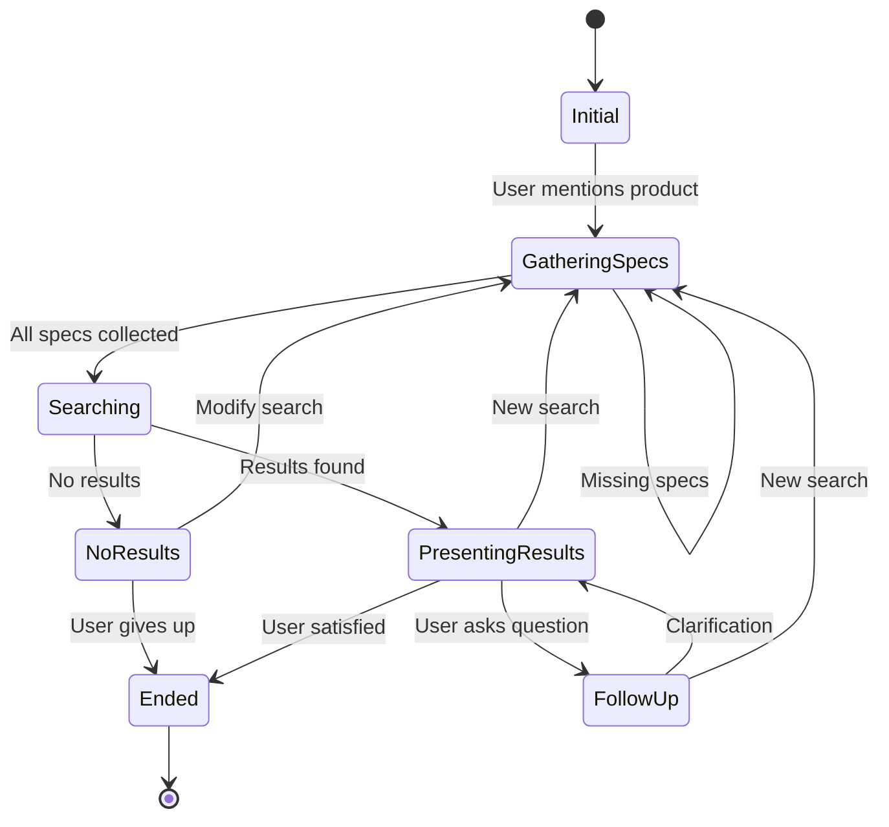

# Conversation Flows

This document describes the typical conversation flows and patterns in the Voice Price Comparison Agent.

## Table of Contents

1. [Overview](#overview)
2. [Conversation States](#conversation-states)
3. [Flow Patterns](#flow-patterns)
4. [Example Conversations](#example-conversations)
5. [Edge Cases](#edge-cases)

## Overview

The Voice Price Comparison Agent uses a state-based conversation model to guide users through the process of finding the best prices for products. The agent intelligently gathers specifications, performs searches, and presents results in a natural, conversational manner.

### Key Principles

- **Progressive Disclosure**: Ask for information incrementally
- **Context Awareness**: Remember previous interactions
- **Graceful Degradation**: Handle errors without breaking the flow
- **Natural Language**: Speak like a human, not a bot

## Conversation States

The agent progresses through these states during a conversation:



### State Descriptions

| State | Description | Agent Behavior |
|-------|-------------|----------------|
| `initial` | Session just started | Greet user, wait for product query |
| `gathering_specs` | Collecting product details | Ask clarifying questions for missing specs |
| `searching` | Performing price search | Search across platforms, validate specs |
| `presenting_results` | Showing price comparison | Present lowest prices, top options |
| `follow_up` | Handling questions | Answer questions about results |
| `ended` | Session completed | Cleanup and goodbye |

## Flow Patterns

### Pattern 1: Complete Specification (Fast Path)

User provides all details upfront → Immediate search → Results

```
User: "Find me the cheapest MacBook Pro 14 inch with M3 Pro chip, 18GB RAM, and 512GB storage"

Agent: "Let me search for the MacBook Pro 14-inch with M3 Pro chip, 18GB RAM, and 512GB storage across multiple platforms."

[Search executes]

Agent: "I found the best prices for you. The lowest price is ₹1,99,900 on Flipkart, followed by ₹2,04,900 on Amazon India, and ₹2,09,900 on Croma. All three have it in stock. Would you like me to search for another product?"
```

**States**: `initial` → `gathering_specs` → `searching` → `presenting_results`

**Duration**: ~3-5 seconds

### Pattern 2: Progressive Specification (Guided Path)

User provides vague query → Agent asks questions → Search → Results

```
User: "I want to buy a laptop"

Agent: "I'd be happy to help you find the best price on a laptop. Which brand are you interested in?"

User: "Apple"

Agent: "Great! Are you looking for a MacBook Air or MacBook Pro?"

User: "MacBook Pro"

Agent: "Perfect. What screen size would you like? 14-inch or 16-inch?"

User: "14 inch"

Agent: "Excellent. Which chip would you prefer? M3, M3 Pro, or M3 Max?"

User: "M3 Pro"

Agent: "Got it. How much RAM do you need? 18GB or 36GB?"

User: "18GB"

Agent: "And for storage, would you like 512GB or 1TB?"

User: "512GB"

Agent: "Perfect! Let me search for the MacBook Pro 14-inch with M3 Pro chip, 18GB RAM, and 512GB storage."

[Search executes]

Agent: "I found the best prices for you. The lowest price is ₹1,99,900 on Flipkart..."
```

**States**: `initial` → `gathering_specs` (multiple turns) → `searching` → `presenting_results`

**Duration**: ~20-30 seconds (6-8 turns)

### Pattern 3: Partial Specification (Mixed Path)

User provides some details → Agent asks for missing ones → Search → Results

```
User: "Show me prices for iPhone 15 Pro"

Agent: "I can help you find the best price for the iPhone 15 Pro. What storage capacity would you like? 128GB, 256GB, 512GB, or 1TB?"

User: "256GB"

Agent: "Great! And which color are you interested in? Natural Titanium, Blue Titanium, White Titanium, or Black Titanium?"

User: "Natural Titanium"

Agent: "Perfect! Let me search for the iPhone 15 Pro 256GB in Natural Titanium."

[Search executes]

Agent: "I found the best prices. The lowest price is ₹1,29,900 on Flipkart..."
```

**States**: `initial` → `gathering_specs` (2-3 turns) → `searching` → `presenting_results`

**Duration**: ~10-15 seconds

### Pattern 4: Follow-up Questions

User asks questions about results → Agent clarifies → Continue or new search

```
[After presenting results]

User: "What about Amazon?"

Agent: "On Amazon India, the MacBook Pro 14-inch with M3 Pro chip, 18GB RAM, and 512GB storage is priced at ₹2,04,900. That's ₹5,000 more than Flipkart's price of ₹1,99,900."

User: "Is it in stock on Flipkart?"

Agent: "Yes, it's currently in stock on Flipkart at ₹1,99,900."

User: "Thank you"

Agent: "You're welcome! Would you like to search for another product, or shall we end the session?"
```

**States**: `presenting_results` → `follow_up` → `presenting_results` or `ended`

### Pattern 5: Multiple Searches

User searches for multiple products in one session

```
[After first search results]

User: "Now find me wireless headphones"

Agent: "I'd be happy to help you find wireless headphones. Which brand are you interested in? Sony, Bose, Apple, or another brand?"

User: "Sony WH-1000XM5"

Agent: "Great choice! What color would you prefer? Black or Silver?"

User: "Black"

Agent: "Let me search for the Sony WH-1000XM5 wireless headphones in black."

[Search executes]

Agent: "I found the best prices. The lowest price is ₹26,990 on Amazon India..."
```

**States**: `presenting_results` → `gathering_specs` → `searching` → `presenting_results`

## Example Conversations

### Example 1: Laptop Search (Complete Spec)

```
👤 User: "Find the cheapest Dell XPS 13 with Intel i7, 16GB RAM, and 512GB SSD"

🤖 Agent: "I'll search for the Dell XPS 13 with Intel Core i7 processor, 16GB RAM, and 512GB SSD across multiple platforms."

[Searching...]

🤖 Agent: "I found the best prices for the Dell XPS 13. The lowest price is ₹1,15,900 on Flipkart, followed by ₹1,18,500 on Amazon India, and ₹1,19,900 on Croma. All three have it in stock. Would you like to search for another product?"

👤 User: "No, thank you"

🤖 Agent: "You're welcome! Have a great day!"
```

### Example 2: Phone Search (Progressive)

```
👤 User: "I need a new phone"

🤖 Agent: "I can help you find the best price on a phone. Which brand are you interested in?"

👤 User: "Samsung"

🤖 Agent: "Great! Which Samsung model are you looking for? Galaxy S24, S24 Plus, S24 Ultra, or another model?"

👤 User: "S24 Ultra"

🤖 Agent: "Perfect! What storage capacity would you like? 256GB, 512GB, or 1TB?"

👤 User: "512GB"

🤖 Agent: "And which color? Titanium Gray, Titanium Black, Titanium Violet, or Titanium Yellow?"

👤 User: "Titanium Black"

🤖 Agent: "Excellent! Let me search for the Samsung Galaxy S24 Ultra 512GB in Titanium Black."

[Searching...]

🤖 Agent: "I found the best prices. The lowest price is ₹1,19,999 on Flipkart, followed by ₹1,21,999 on Amazon India, and ₹1,24,999 on Samsung's official store. All are in stock. Would you like to search for another product?"
```

### Example 3: Headphones Search (Partial Spec)

```
👤 User: "Show me prices for Sony WH-1000XM5"

🤖 Agent: "I can help you find the best price for the Sony WH-1000XM5 headphones. What color would you prefer? Black or Silver?"

👤 User: "Black"

🤖 Agent: "Perfect! Let me search for the Sony WH-1000XM5 wireless headphones in black."

[Searching...]

🤖 Agent: "I found the best prices. The lowest price is ₹26,990 on Amazon India, followed by ₹27,490 on Flipkart, and ₹29,990 on Croma. All three have it in stock. The price difference between Amazon and Flipkart is minimal at just ₹500. Would you like to search for another product?"
```

### Example 4: Tablet Search with Follow-up

```
👤 User: "Find me an iPad"

🤖 Agent: "I'd be happy to help you find the best price on an iPad. Which model are you interested in? iPad, iPad Air, iPad Pro, or iPad Mini?"

👤 User: "iPad Air"

🤖 Agent: "Great! What screen size? 11-inch or 13-inch?"

👤 User: "11 inch"

🤖 Agent: "Perfect. What storage capacity? 128GB, 256GB, 512GB, or 1TB?"

👤 User: "256GB"

🤖 Agent: "And would you like Wi-Fi only or Wi-Fi + Cellular?"

👤 User: "Wi-Fi only"

🤖 Agent: "Excellent! Let me search for the iPad Air 11-inch 256GB Wi-Fi."

[Searching...]

🤖 Agent: "I found the best prices. The lowest price is ₹69,900 on Flipkart, followed by ₹71,900 on Amazon India, and ₹74,900 on the Apple Store. All are in stock."

👤 User: "What colors are available on Flipkart?"

🤖 Agent: "On Flipkart, the iPad Air 11-inch 256GB Wi-Fi is available in Space Gray, Starlight, Pink, Purple, and Blue at ₹69,900."

👤 User: "Perfect, thank you"

🤖 Agent: "You're welcome! Would you like to search for another product?"

👤 User: "No, that's all"

🤖 Agent: "Great! Have a wonderful day!"
```

## Edge Cases

### Case 1: No Results Found

```
👤 User: "Find me a laptop with 256TB of RAM"

🤖 Agent: "I searched for a laptop with 256TB of RAM, but I couldn't find any results. This specification is unusually high for consumer laptops. Did you mean 256GB of RAM, or would you like to adjust your search?"

👤 User: "Yes, 256GB"

🤖 Agent: "Let me search for laptops with 256GB of RAM."

[Searching...]

🤖 Agent: "I found a few options with 256GB RAM..."
```

### Case 2: Ambiguous Product Name

```
👤 User: "Find me a Mac"

🤖 Agent: "I'd be happy to help you find a Mac. Are you looking for a MacBook (laptop), iMac (desktop), Mac Mini, Mac Studio, or Mac Pro?"

👤 User: "MacBook"

🤖 Agent: "Great! MacBook Air or MacBook Pro?"

[Continues with specification gathering...]
```

### Case 3: Out of Stock Everywhere

```
👤 User: "Find me the iPhone 14 Pro 1TB in Gold"

🤖 Agent: "Let me search for the iPhone 14 Pro 1TB in Gold."

[Searching...]

🤖 Agent: "I searched across multiple platforms, but the iPhone 14 Pro 1TB in Gold appears to be out of stock everywhere. Would you like me to search for a different color or storage capacity?"

👤 User: "Try Deep Purple"

🤖 Agent: "Let me search for the iPhone 14 Pro 1TB in Deep Purple."

[Searching...]

🤖 Agent: "I found it in stock! The lowest price is ₹1,59,900 on Flipkart..."
```

### Case 4: Price Difference Too Small

```
[After search]

🤖 Agent: "I found the best prices for the Sony WH-1000XM5. The lowest price is ₹26,990 on Amazon India, followed by ₹27,090 on Flipkart, and ₹27,190 on Croma. All three have it in stock. The price differences are minimal at less than 1%, so you might want to consider other factors like delivery time or return policy."
```

### Case 5: User Wants to Exit

```
👤 User: "Actually, I changed my mind"

🤖 Agent: "No problem! Would you like to search for a different product, or shall we end the session?"

👤 User: "Let's end it"

🤖 Agent: "Alright! Feel free to come back anytime you need help finding the best prices. Goodbye!"
```

### Case 6: Search API Failure

```
[During search]

🤖 Agent: "I'm having trouble connecting to the search service right now. Let me try again..."

[Retry with fallback]

🤖 Agent: "I found the prices using an alternative search method. The lowest price is..."

[Or if all fail]

🤖 Agent: "I apologize, but I'm unable to complete the search at the moment due to technical difficulties. Please try again in a few minutes."
```

### Case 7: Speech Recognition Failure

```
[After unclear audio]

🤖 Agent: "I'm sorry, I didn't quite catch that. Could you please repeat what you said?"

[After second failure]

🤖 Agent: "I'm having trouble understanding the audio. Could you try speaking a bit more clearly or checking your microphone?"
```

## Supported Platforms

The agent searches across these Indian e-commerce platforms:

- **Flipkart**: General e-commerce
- **Amazon India**: General e-commerce
- **Myntra**: Fashion and lifestyle
- **Croma**: Electronics
- **Reliance Digital**: Electronics
- **Vijay Sales**: Electronics
- **Tata Cliq**: General e-commerce
- **Snapdeal**: General e-commerce

## Product Categories

The agent handles these product categories with category-specific specifications:

### Laptops
- Brand, Model, Screen Size
- Processor (Intel/AMD/Apple)
- RAM, Storage
- Graphics Card (optional)
- Color (optional)

### Phones
- Brand, Model
- Storage Capacity
- Color
- Network (5G/4G)

### Tablets
- Brand, Model
- Screen Size
- Storage Capacity
- Connectivity (Wi-Fi/Cellular)
- Color (optional)

### Headphones
- Brand, Model
- Type (Over-ear/On-ear/In-ear)
- Connectivity (Wired/Wireless)
- Color (optional)

### Monitors
- Brand, Model
- Screen Size
- Resolution
- Refresh Rate (optional)
- Panel Type (optional)

### Cameras
- Brand, Model
- Type (DSLR/Mirrorless/Point-and-shoot)
- Megapixels (optional)
- Lens Kit (optional)

## Best Practices

### For Users

1. **Be Specific**: Provide as many details as possible upfront
2. **Speak Clearly**: Ensure good audio quality for accurate transcription
3. **One Product at a Time**: Complete one search before starting another
4. **Ask Follow-ups**: Don't hesitate to ask clarifying questions about results

### For Developers

1. **Handle Ambiguity**: Always clarify unclear specifications
2. **Validate Input**: Check that specifications make sense for the product category
3. **Provide Context**: Explain why you're asking for specific information
4. **Be Concise**: Keep voice responses short and clear
5. **Confirm Actions**: Always confirm before performing searches
